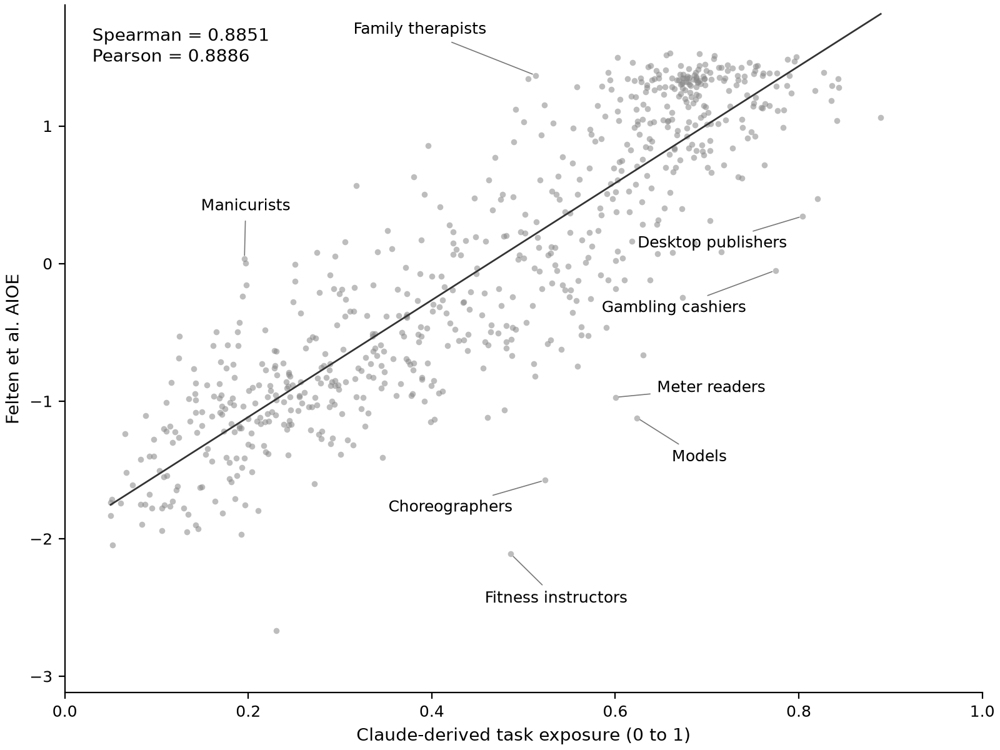

# AI exposure: early research measures versus modern LLM judgments

I compare occupational AI exposure judgments from **Claude Fable** with the AI Occupational Exposure (AIOE) measure of Felten, Raj, and Seamans (2021). I asked Claude to score 332 O*NET Intermediate Work Activities, then used O*NET crosswalks and task weights to estimate exposure for 923 occupations. I also compare the scores with published language-modeling AIOE and explore a 50/50 hybrid.

Claude judges work activities; Felten's earlier measure links AI applications to human abilities through survey-based mappings. My comparison captures differences in judgment source, measurement design, and capability vintage.



I compare 683 matched occupations; labels mark the eight largest absolute rank gaps.

## Main findings

My Claude-derived task model covers 18,796 tasks. Mean occupational exposure is **0.485** on a 0–1 scale, with a standard deviation of **0.208**. I weight occupations equally, not by employment.

| Result | Estimate | Interpretation |
| --- | ---: | --- |
| Claude-derived–AIOE rank correlation | 0.885 | Strong agreement across 683 matched six-digit SOC occupations |
| Claude-derived–language-modeling AIOE rank correlation | 0.879 | A similar broad ordering under the language-modeling benchmark |
| Claude-derived–AIOE Pearson correlation | 0.889 | Strong linear association within the matched sample |
| Hybrid mean exposure | 0.472 | The 50/50 blend slightly lowers average scores |
| Hybrid standard deviation | 0.179 | The blend compresses the distribution relative to the task model |
| Task–hybrid Pearson correlation | 0.981 | Broad ordering is stable, with meaningful changes for some occupations |

Medical transcriptionists score 0.889, credit analysts 0.843, and bookkeeping clerks 0.842. Roofers score 0.083, stonemasons 0.051, and dishwashers 0.050.

Average exposure rises from Job Zone 2 (0.324) through Zone 3 (0.470) to Zone 4 (0.656), then falls in Zone 5 (0.601). Job Zones describe occupational preparation requirements; this pattern does not establish education as a cause of exposure.

The hybrid raises oral and maxillofacial surgeons from 0.194 to 0.398, about 21.2 percentile points. Geographers move down about 15.6 percentile points.

**Significance.** Directly eliciting judgments from Claude Fable produces occupational rankings that broadly resemble those from an earlier, researcher-designed exposure framework: the main rank correlation is 0.885. This suggests that an LLM can reproduce much of that ordering through a comparatively simple elicitation approach. It does not show that Claude is more accurate or independently discovered the same relationships. I cannot separate newer capabilities from differences in measurement or model judgment. Both measures use O*NET, and Claude may have encountered the research in training. I do not test predictive accuracy against adoption, productivity, wages, or employment.

## Methodology

### 1. Elicit Claude Fable judgments of work activities

I asked Claude Fable to classify 332 Intermediate Work Activities (IWAs) using this rubric, assessing the share AI could perform or substantially assist with mid-2026 language, multimodal, and software-agent capabilities.

| Score | Rubric interpretation |
| --- | --- |
| 0.90–1.00 | Near end-to-end capability under the rubric's assumptions |
| 0.70–0.85 | Most work can be assisted or performed, with human review |
| 0.45–0.65 | Substantial assistance, with human execution central |
| 0.15–0.40 | Limited assistance, often sensing or diagnosis |
| 0.00–0.10 | Little exposure, typically embodied or manual activity |

The [saved scores](data/rubric/iwa_exposure_scores.csv) are Claude's judgments, not measured AI performance.

### 2. Map activities to tasks and occupations

Each of 2,087 Detailed Work Activities (DWAs) inherits its parent IWA score. I average linked DWA scores for each task, covering all 18,796 task statements, then aggregate for occupation `o`:

```text
task_score(t) = mean(score of each DWA linked to t)
weight(t) = importance(t) × relevance(t) / 100
exposure(o) = sum(weight(t) × task_score(t)) / sum(weight(t))
```

Importance uses O*NET's 1–5 scale; relevance uses 0–100. I default missing importance to 3 and missing relevance to 100 for Core tasks, 50 for Supplemental tasks, and 75 otherwise.

I report task-weight shares with exposure at least 0.70 or at most 0.30. Channel shares use each task's most frequent DWA channel, breaking ties alphabetically. They measure task weight, not worker time.

### 3. Compare LLM-derived exposure with published research measures

I average detailed occupations into six-digit SOC codes and match 683 of the 923 occupations to Felten's Appendix A, without a historical SOC crosswalk. I also compare language-modeling AIOE.

Pearson correlations compare levels; Spearman correlations compare rankings. `ensemble_z` averages task and AIOE z-scores within the matched sample. Rank 1 means greatest exposure; exported ranks truncate average ranks for ties. Correlations use underlying scores.

### 4. Explore a hybrid of LLM judgments and the research measure

I map 52 abilities from Felten's Appendix E to 41 Generalized Work Activities (GWAs) using O*NET, averaging linked ability scores. I harmonize “Visual Color Determination” to “Visual Color Discrimination.”

I rescale GWA ability scores to the mean and sample standard deviation of the rubric's GWA means, clip to [0, 1], then calculate:

```text
hybrid_iwa = 0.5 × rubric_iwa + 0.5 × rescaled_ability_score(parent_GWA)
```

I apply the same task mapping and weighting. The 50/50 blend is a secondary exploration, not an estimated optimum.

## Interpretation and limitations

A score of 0.8 is an exposure index, not an 80% replacement probability or an 80% reduction in labor hours. I do not separate augmentation from substitution, model adoption costs, or estimate net employment effects.

I assign the same score to all DWAs within an IWA. Task ratings can lag changes in work, and exact SOC matching can miss classification changes. The hybrid depends partly on its imposed scaling. I have not tested uncertainty, other LLMs, or sensitivity to prompts, scores, and blend weights.

[data/rubric/PROMPT.md](data/rubric/PROMPT.md) documents the elicitation; I did not record sampling settings or run repeated trials.

## Project structure

```text
data/
  onet/                  O*NET 30.3 source workbooks
  felten/                Published AIOE source material
  rubric/                Claude Fable scores and PROMPT.md
scripts/
  01_task_exposure.py     Activity-to-task-to-occupation estimates
  02_hybrid_exposure.py   Published-measure comparison and hybrid estimates
  03_results.py          Summary statistics and HTML reports
  04_figure.py           Task exposure versus AIOE scatter plot
results/
  task/                  Task model tables and Job Zone summary
  hybrid/                Hybrid scores and matched comparison
  reports/               Two self-contained HTML reports
  summary.csv            Headline statistics
```

See [data/README.md](data/README.md) for inputs and attribution.

## Reproduce the results

I tested with Python 3.14.6 and the versions in `requirements.txt`. From the project root:

```bash
python3 -m venv .venv
source .venv/bin/activate
python -m pip install -r requirements.txt
python scripts/01_task_exposure.py
python scripts/02_hybrid_exposure.py
python scripts/03_results.py
python scripts/04_figure.py
```

On Windows, activate with `.venv\Scripts\activate`. Run scripts in numerical order. They read local inputs and overwrite their outputs, with no API keys or network calls. CSV estimates use four decimal places; summary statistics use those saved estimates.

### Run the checks

`python -m pytest tests/`

## Results files

| File | Contents |
| --- | --- |
| [Task occupation scores](results/task/occupation_exposure.csv) | Exposure, task counts, high/low shares, channel shares, percentile |
| [Task scores](results/task/task_exposure.csv) | Task text, exposure, DWA count, channel, importance, relevance, weight |
| [GWA summary](results/task/gwa_summary.csv) | Mean, minimum, maximum, and count of Claude IWA scores within each GWA |
| [Job Zone summary](results/task/job_zone_summary.csv) | Occupation counts and unweighted mean exposure by preparation level |
| [Hybrid occupation scores](results/hybrid/occupation_exposure_hybrid.csv) | Original and hybrid exposure, difference, and percentiles |
| [Matched comparison](results/hybrid/comparison_occupation.csv) | Task, AIOE, LM-AIOE, standardized ensemble, and ranks |
| [Hybrid activity scores](results/hybrid/iwa_scores_hybrid.csv) | Claude score, rescaled ability channel, and blended score |
| [Summary statistics](results/summary.csv) | Coverage, means, standard deviations, and correlations |

Open the [task report](results/reports/ai-exposure-report.html) and [comparison report](results/reports/exposure-comparison.html) locally in a browser. They need no external assets; GitHub displays their source.

Exposure and percentiles are fractions, increasing with exposure. `delta` is hybrid minus original; `rank_gap` is task rank minus AIOE rank, positive when AIOE ranks higher. Channels: INFO (information), ANLY (analysis), CRTV (creative), TECH (technical), SOCL (social), MGMT (management), CARE (care), PHYS (physical), MACH (machinery).

## Sources and reuse

Felten, E., Raj, M., & Seamans, R. (2021). Occupational, industry, and geographic exposure to artificial intelligence: A novel dataset and its potential uses. *Strategic Management Journal, 42*(12), 2195–2217. [Article](https://doi.org/10.1002/smj.3286) · [Authors' data repository](https://github.com/AIOE-Data/AIOE).

Felten, E., Raj, M., & Seamans, R. (2023). How will Language Modelers like ChatGPT Affect Occupations and Industries? [Working paper](https://arxiv.org/abs/2303.01157).

This project incorporates information from the O*NET 30.3 Database, U.S. Department of Labor, Employment and Training Administration (USDOL/ETA), licensed under [CC BY 4.0](https://creativecommons.org/licenses/by/4.0/). O*NET® is a trademark of USDOL/ETA. The exposure scores and aggregations are project adaptations; USDOL/ETA has not approved, endorsed, or tested them.

The code and rubric in this repo are [MIT licensed](LICENSE). O*NET data are CC BY 4.0 as attributed above. The Felten, Raj and Seamans workbooks are included as downloaded from the authors' public repository, which requests citation, and remain under the authors' terms.
