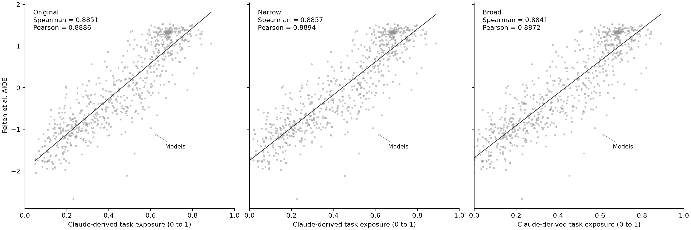

# Physical-task robustness check

I test how the comparison changes when I assign zero exposure to tasks linked to physical O*NET activity categories. I use only the published hierarchy, with no task-text rules, new LLM judgments, or occupation-specific exceptions.

| Rule | Generalized Work Activity codes |
| --- | --- |
| Narrow | `4.A.3.a.1` Performing General Physical Activities; `4.A.3.a.2` Handling and Moving Objects |
| Broad | Both narrow categories, plus `4.A.3.a.3` Controlling Machines and Processes and `4.A.3.a.4` Operating Vehicles, Mechanized Devices, or Equipment |

If any DWA linked to a task falls under a selected category, I set the entire task's exposure to zero, including mixed physical and nonphysical tasks. I retain its importance × relevance weight in the denominator. I count all flagged tasks, including those already scored zero.

I reconstruct the baseline task means from the saved rubric and crosswalk and the weights from saved importance and relevance ratings. I verify that the reconstructed occupation scores reproduce the original four-decimal estimates. I then apply each override, retain the original occupation weighting, round occupation scores to four decimals, and average detailed occupations into six-digit SOC codes. I use exactly the original 683 matched occupations and saved AIOE values. Correlations use the exported comparison scores, with average ranks for Spearman ties.

| Variant | Flagged tasks | Mean flagged task-weight share across 923 occupations | Mean exposure | Pearson | Spearman |
| --- | ---: | ---: | ---: | ---: | ---: |
| Original | 0 | 0.00% | 0.4849 | 0.8886 | 0.8851 |
| Narrow | 3,648 | 20.04% | 0.4684 | 0.8894 | 0.8857 |
| Broad | 4,382 | 24.34% | 0.4604 | 0.8872 | 0.8841 |

I find little change in agreement with AIOE under either rule. These are sensitivity checks under an assumed zero exposure for selected physical categories, not evidence that the adjusted scores are more accurate. Physical work can still receive AI assistance, and a task with one physical component can also contain exposed components.

The hierarchy also misses physical work mapped elsewhere. Models falls from 0.6238 to 0.6155 under both rules. Its posing, styling, dressing, and collaboration tasks map to “Promote products, services, or programs” and remain at 0.65. I make no exception for these tasks. Care or repair tasks outside the selected categories can likewise remain unflagged; this is not a complete physical/nonphysical classification.



I compare the same occupations on common axes; each panel shows a least-squares line and labels Models to make this limitation visible.

## Reproduce

From the project root, after generating the original results:

```bash
python scripts/05_physical_robustness.py
python -m pytest tests/
```

## Outputs

- `activity_audit.csv`: every task-to-DWA link, parent IWA and GWA, rubric score, and both rule flags.
- `task_overrides.csv`: every task, original and adjusted scores, weights, and flags.
- `occupation_exposure.csv`: original and adjusted occupation scores, changes, and flagged task-weight shares.
- `comparison_occupation.csv`: original and adjusted scores for the fixed 683-occupation sample.
- `summary.csv`: counts, mean exposure, mean flagged weight shares, and correlations.
- `physical_override_comparison.png`: three-panel comparison at 200 dpi.
