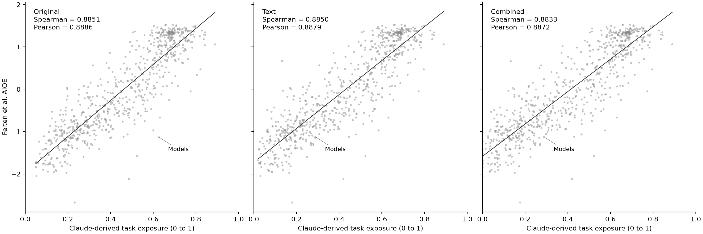

# Physical task language robustness check

I test a further assumption: a task receives zero exposure if its description contains any entry in my fixed [pattern list](../../data/rubric/physical_task_patterns.csv). I match case-insensitively with word boundaries. I do not use an LLM, semantic classification, or occupation-specific exceptions.

I report the text rule on its own and combined with the previous broad O*NET hierarchy rule. Combined means either rule flags the task. I set the whole task to zero, including mixed tasks, and retain its original weight in the denominator. All previous estimates remain unchanged.

## Rules and tradeoffs

My seven rule groups cover apply; movement verbs; handling verbs; operation verbs; body-care verbs; “pose for” or “pose as”; and selected physical objects. The CSV publishes every regular expression and its tradeoff. Matching is literal, so “apply” does not also match “applying.” I export all matching rule IDs and matched text for every task in `task_overrides.csv`, including unflagged tasks.

I deliberately accept false positives. “Apply” can describe applying makeup, principles, or computer methods. For example, the rule flags “Apply theoretical expertise and innovation to create or apply new technology, such as adapting principles for applying computers to new uses” for Computer and Information Research Scientists. “Install” can refer to software; “run” can refer to programs; mentioning machinery does not mean operating it. There are no negation or context exceptions.

The list also misses physical tasks expressed with other words or inflections. Zeroing a mixed task discards its nonphysical components. This is a deliberately coarse sensitivity test, not a validated classification of physical work or a preferred replacement for the original estimates.

I chose the list after inspecting the Models outlier, so this check is exploratory and not independent of that observation. Its decline cannot validate the rule. I did not tune the patterns to maximize agreement with AIOE.

## Results

| Variant | Flagged tasks | Mean flagged task-weight share across 923 occupations | Mean exposure | Pearson | Spearman |
| --- | ---: | ---: | ---: | ---: | ---: |
| Original | 0 | 0.00% | 0.4849 | 0.8886 | 0.8851 |
| Text | 2,777 | 15.58% | 0.4546 | 0.8879 | 0.8850 |
| Combined | 5,242 | 29.10% | 0.4399 | 0.8872 | 0.8833 |

I find little change in correlation on the same 683 matched occupations. Models falls from 0.6238 to 0.2879 under both variants, compared with 0.6155 under the hierarchy rules. This reflects the chosen text matches, not evidence of improved accuracy. Counts include flagged tasks that already had zero exposure.



## Calculation and reproduction

I read the full-precision baseline task scores, weights, and broad flags from `results/robustness/task_overrides.csv`. I keep the same importance × relevance weighting, round occupation scores to four decimals, average detailed occupations into six-digit SOC codes, and round the comparison scores to four decimals. I use the original matched sample and saved AIOE scores. Spearman uses average ranks for ties. Mean weight shares give each occupation equal weight and are not employment-weighted or time shares.

After scripts 01 through 05, run:

```bash
python scripts/06_text_robustness.py
python -m pytest tests/
```

Outputs here include `task_overrides.csv` with the match audit, `occupation_exposure.csv` with adjusted scores and changes, `comparison_occupation.csv` for the fixed sample, `summary.csv`, and the 200 dpi comparison figure. The task audit retains the earlier hierarchy flags to show overlap.
